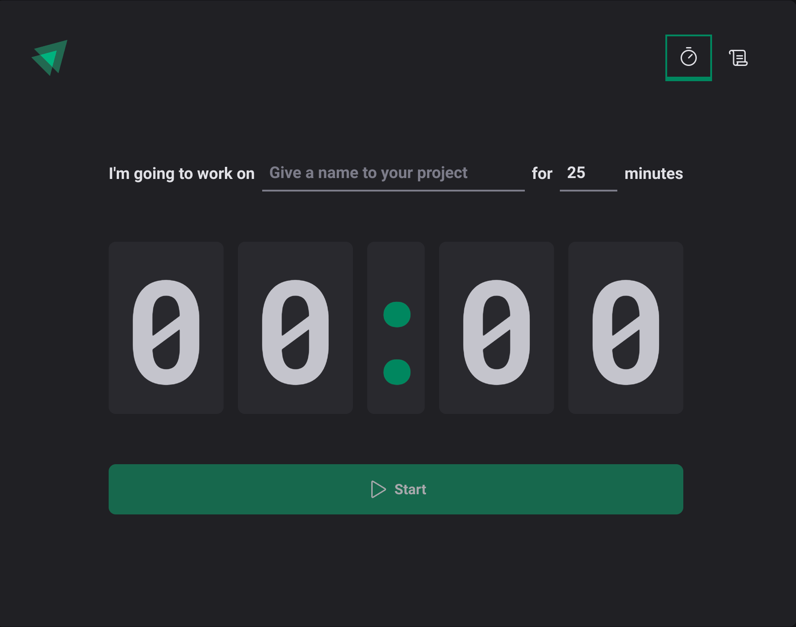
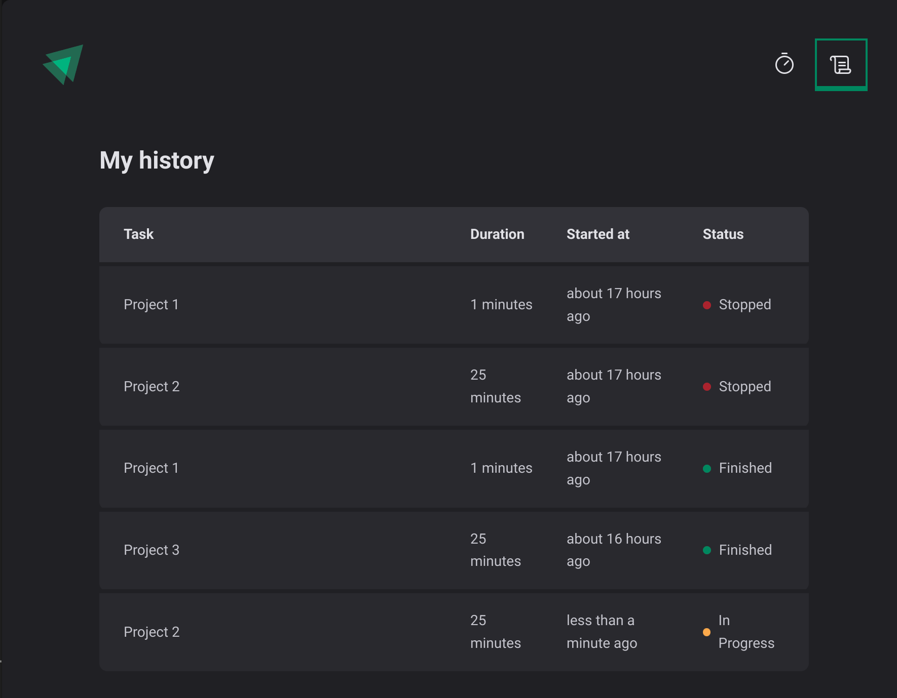

# Pomodoro Timer

## Screenshots

Below are some screenshots of the application. These images showcase the user interface for a tablet-sized view.

|  |  |
| :-------------------------------------: | :-------------------------------------: |

## Overview

This project is a study initiative designed to reinforce best practices in web development using React. It aims to strengthen the understanding of React components, hooks, state management, and modern JavaScript techniques, along with good software engineering practices. The Pomodoro Timer is a simple application implementing the Pomodoro Technique, a productivity method that helps users break down work into focused intervals.

## Features

- **Pomodoro Timer**: Customizable durations for work and break sessions, allowing users to personalize their productivity intervals.
- **Task Management**: Users can add tasks to help keep track of their work during each Pomodoro session.
- **Session Tracking**: Keeps count of completed work and break sessions, giving users a sense of accomplishment.
- **Responsive Design**: Optimized for use on tablets and other devices, ensuring a consistent user experience across different screen sizes.
- **Theming**: Styled-components are used to manage the visual appearance, allowing for consistent and maintainable theming throughout the app.
- **Context API for State Management**: The application's state, such as tasks and timer settings, is managed using React's Context API, providing a clean and scalable way to manage global state.
- **Persistent State**: The app leverages `localStorage` to persist task data and timer settings, ensuring that users can resume their session after a page reload.

## Libraries Used

This project leverages a few libraries to enhance the development process and improve the overall experience:

1. **React** - The core library used for building the user interface, allowing the creation of reusable components.
2. **React Router DOM** - Enables navigation between different views of the application without a page refresh, providing a seamless single-page application experience.
3. **styled-components** - A CSS-in-JS library used for styling the application, providing the flexibility to write CSS directly in JavaScript while maintaining styles scoped to individual components.
4. **dayjs** - A lightweight library used for date and time manipulation, ensuring simple and efficient operations for timer countdowns and formatting.
5. **react-hook-form** - A library for managing forms in React, making it easier to handle validation, form state, and error messages.
6. **@hookform/resolvers** - Provides integration with external schema validation libraries like Zod, simplifying form validation.
7. **zod** - A TypeScript-first schema declaration and validation library that helps ensure data integrity and validation.
8. **immer** - A library that allows working with immutable state in a more convenient way, simplifying state updates.
9. **phosphor-react** - A collection of icons used throughout the application to enhance the user interface.

These libraries bring significant value to React projects, allowing for enhanced modularity, styling ease, efficient navigation, and optimized form handling and state management.

## Installation

To get started with the project, follow these steps:

1. Clone the repository:
   ```bash
   git clone <repository-url>
   ```
2. Navigate to the project directory:
   ```bash
   cd pomodoro-timer
   ```
3. Install the dependencies:
   ```bash
   npm install
   ```
4. Start the development server:
   ```bash
   npm run dev
   ```

## Usage

The Pomodoro Timer can be used to enhance productivity by breaking work into focused intervals followed by short breaks. Customize the timer settings according to your needs, and start a productive work session.

### Task Management
- **Add Tasks**: Users can add tasks to help organize what they need to focus on during each Pomodoro.

### Timer Control
- **Start and Stop**: The timer includes controls to start a new countdown or stop an active timer. Users can either stop the timer before it completes or let it run until the end of the session.


### State Persistence
- **Persistent Task List**: Task information is stored in `localStorage`, allowing users to retain their task list even after refreshing or closing the browser.
- **Settings Persistence**: Timer settings are also saved in `localStorage`, so users do not need to reconfigure their preferences every time they use the app.

## Technologies

- **React**: Front-end library for building user interfaces.
- **JavaScript (ES6+)**: Modern JavaScript syntax for concise and efficient code.
- **styled-components**: CSS-in-JS for component-level styling.
- **HTML5 & CSS3**: Basic building blocks for the application's structure and styling.
- **TypeScript**: Strongly-typed JavaScript, ensuring better code quality and development experience.
- **Vite**: A fast build tool that provides an optimized development environment for modern web projects.

## Learning Goals

This project serves as a hands-on approach to mastering web development fundamentals, specifically:

- Understanding and applying React hooks for state and lifecycle management.
- Developing single-page applications (SPA) using React Router.
- Implementing component-based styling using styled-components.
- Reinforcing the use of modern JavaScript and best coding practices.
- Learning TypeScript to improve code reliability and readability.
- Managing global state with React Context and persisting it using `localStorage`.

## License

This project is licensed under the MIT License - see the LICENSE file for details.